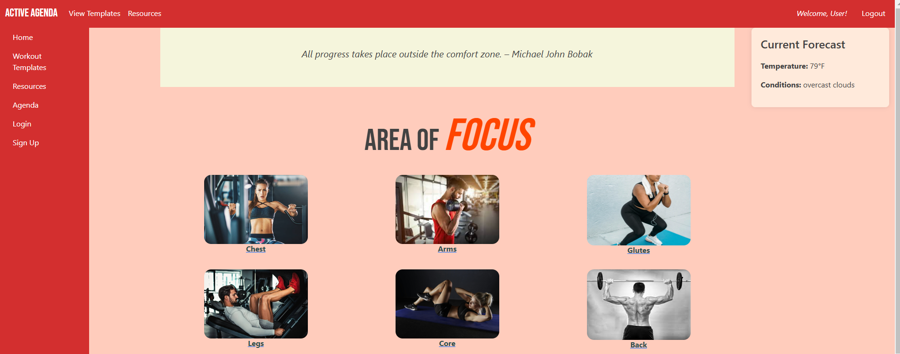

[Active Agenda](https://t3-fitness-app-from-scratch.web.app/)

# Active Agenda
T3 end-of-term project in which we are creating a fitness web app from scratch. 

## Description
Discover a curated selection of the finest resources in health and wellness with Active Agenda. Whether you're a fitness enthusiast, a wellness seeker, or just beginning your journey towards a healthier lifestyle, Active Agenda provides you with high-quality information and tools to support your goals.

## Getting Started
Simply click the link above and check ou the site!

## Layout

### Hompage 
The Homepage allows you to access different sections of the website created in a easy to use layout.

### Workout Templates
Have no idea how to start to your fitness journey? Navigate to the workout tmeplates page to get free sample workouts to take the stress of finding the right workouts yourself. Our templates are broken in up into different sections based on muscule group so you can create the best program that fits your goals.

### Resources
If you want to learn more about improving your health and well being, check out the resource page. Where we hold all the best health and fitness tools curated all in one place. Whether you are visual learner to someone who likes to go in depth on a subject the resource page is where it is.

### Agenda 
Organize your life to help keep your workout routine going. Drag and drop different templates to organize workouts for weeks. Plan accordingly with our weather feature as well, we want you to keep on track! The Agenda is unfortunaley not available at this time. One of the challenges of finishing this project was getting the API integrated in order to get the agenda feature to work. This functionality will be added in future updates.

## Development Story

The journey of developing **Active Agenda** began as a collaborative effort during our end-of-term project in trimester 3. We wanted to create a comprehensive fitness web app that would assist users in achieving their health and wellness goals. Our vision was to provide a centralized platform where users could access workout templates, resources, and organizational tools.

### Initial Concept and Planning
From the outset, we focused on creating an intuitive user experience. We brainstormed features that would cater to various user needs, from fitness beginners to enthusiasts. Our project timeline was tight, prompting us to prioritize essential features for our first release.

## Implemented Features
1. **Homepage**: 
   - A user-friendly interface that directs users to different sections of the app.

2. **Workout Templates**: 
   - A dedicated page offering free sample workouts categorized by muscle group, making it easy for users to start their fitness journey.

3. **Resources**: 
   - A curated collection of health and fitness tools, providing valuable information and support for users looking to improve their well-being.

4. **Agenda**: 
   - A drag-and-drop feature for organizing workouts, though it is currently unavailable due to API integration challenges.

## Features Still to Implement
1. **Agenda Functionality**:
   - Integration of the Agenda feature with an API to allow users to plan their workouts effectively.

2. **User Accounts**:
   - Implement user account creation to allow personalized experiences and save progress.

3. **Fitness Tracking**:
   - Add features for users to track their workouts and progress over time.

4. **Enhanced Resources**:
   - Expand the resources section to include videos, articles, and interactive tools for better engagement.

## Challenges Encountered
The development process was not without its challenges:

1. **API Integration**:
   - The most significant hurdle was successfully integrating the API for the Agenda feature. We faced difficulties in ensuring the feature worked seamlessly with our existing setup.

2. **Time Constraints**:
   - With limited time for development, we had to make tough decisions about which features to prioritize for the initial release.

3. **User Experience Design**:
   - Balancing functionality with an intuitive user interface required careful planning and iterative design.

4. **Debugging**:
   - As with any project, we encountered bugs during testing. Addressing these in a timely manner was crucial to maintaining project momentum.

---

## Technologies Used
Google FireBase/FireStore, JavaScript, HTML, CSS

##### Authors 
Ryan Donaldson [(GitHub)](https://github.com/donaldrs01)  
Jess Dison [(GitHub)](https://github.com/jessasesh)
Luke Scuhula [GitHub](https://github.com/lukeschula) [Linkedin](https://www.linkedin.com/in/luke-schula-480548169/)

